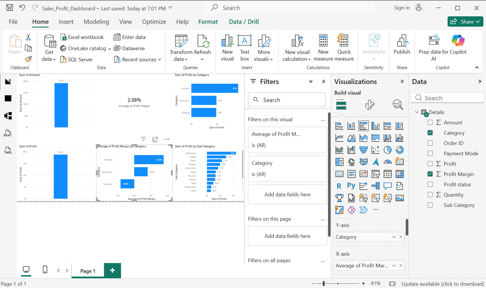

# Stock Valuation Screener
## 📊 Power BI Dashboard
This dashboard analyzes sales, profit, and profit margins across categories and sub-categories.

## Overview
This project identifies undervalued stocks using Free Cash Flow (FCF) data and a simplified Discounted Cash Flow (DCF) valuation model.

The program analyzes company financial data and estimates intrinsic value to determine whether a stock may be undervalued compared to its current market price.

## Workflow
1. Load the financial dataset using Python and Pandas
2. Clean and convert financial columns to numeric values
3. Calculate the average Free Cash Flow (FCF)
4. Estimate intrinsic value using a simplified DCF model
5. Compute an undervaluation score
6. Rank companies based on how undervalued they appear

## Files in this Repository
- `undervalued_stocks.ipynb` – Main Python analysis notebook
- `india_fcf_dataset.csv` – Financial dataset used for analysis
- `undervalued_stocks.csv` – Output file containing ranked undervalued stocks

## Technologies Used
- Python
- Pandas
- Jupyter Notebook

## Purpose
This project demonstrates how financial analysis and programming can be combined to build a basic stock valuation screener.
